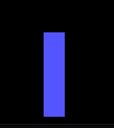

## Project report

### Clear screen
For this, I used code below.

```asm
mov al, 06H       ;scroll up
mov bh, 00H
mov cx, 0000H
mov dx, 184FH
INT 10H
```

### Graphic mode
Then, I insert the program into graphic mode.

```asm
mov al, 13H
mov AH, 0
INT 10H
```
### Init Socre
In order to show the score, I inserted a init score function to show the score in the page.

```
mov DL, '0'
mov AH, 2
INT 21h
```
### Border
The game has a border that defines the edges of the game.
For this, I inserted 2 pixels and extended them to draw a line.

### Main loop
The whole game is inside a loop which repeats until the user loses.

### Main Functions

#### Shift down 
It is a function that moves the shapes down.
It has a simple algorithm that is the code below.

```asm
mov color, 0
call draw_shape
mov dx, start_row_sq
add dx, block_size
mov start_row_sq, dx
mov color, 14
call draw_shape
call fall_delay
```
First, the color is set to 0 to remove the last effect of the shape, then **draw shape** is called which draws our shape. Then, the **row** of the shape is added by a block size which sets the start row of the shape at the new position.

#### shift right, left
It is similar to shift right, the difference is that the column is changed instead of the row.

#### delay function
The shapes come down do fast, so we set a delay in order to make them fall slower and also by block size.

#### Rotate
By pressing **w**, The shapes rotate *90* clockwise. Like others, the new shapes have a new function to be drawn.




#### input checking
For checking user inputs, At first, we use code below to make the keyboard responsive.

```asm
mov ah, 1
int 16h
```

Then, we should make it non-blocking, so code below is used for handling user inputs.

```asm
mov ah, 00h
int 16h

push ax    
mov ah, 6 ; direct console I/O
mov dl, 0FFh ; input mode
int 21h 
pop ax

cmp al,'d'
je d_key_pressed

cmp al, 'D'
je d_key_pressed

cmp al, 'A'
je l_key_pressed

cmp al, 'a'
je l_key_pressed

cmp al, 's'
je s_key_pressed

cmp al, 'S'
je s_key_pressed

cmp al, 'W'
je w_key_pressed

cmp al, 'w'
je w_key_pressed

```

### Shape initialization

When each sahpe comes down, the value of its first location is initialized to get ready for the next fall.
